# Agentic RAG — System Architecture (Ipoteka Bank HR Assistant)

> Auto-generated from codebase. Updated: 2026-03-17

---

## 1. Service Topology (Docker Compose)

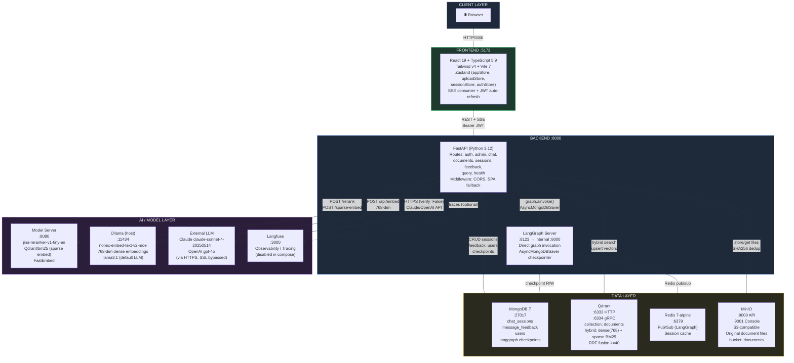

---

## 2. LangGraph Agent Flow (Full State Machine)

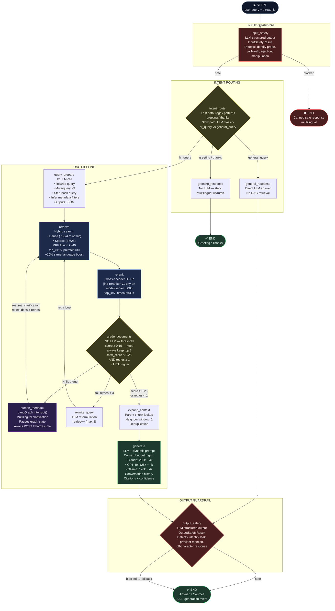

---

## 3. Document Ingestion Pipeline

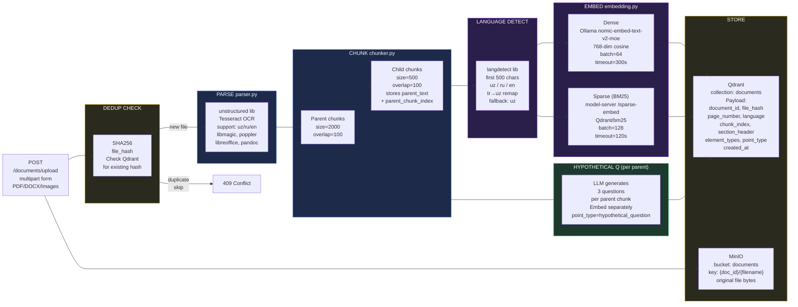

---

## 4. Hybrid Search Internals (Qdrant RRF)

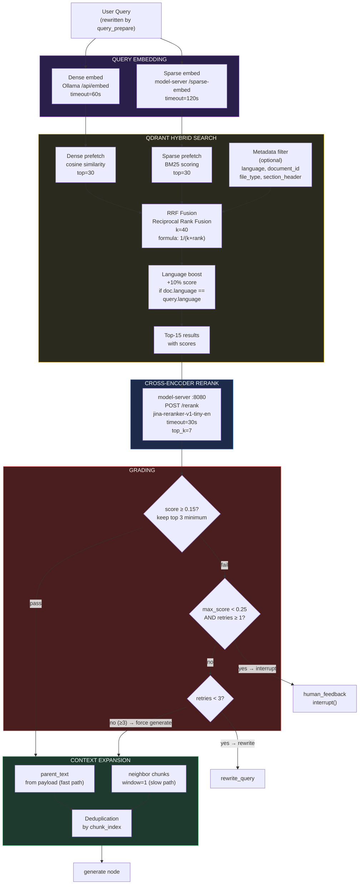

---

## 5. Chat Request — Full Sequence Diagram

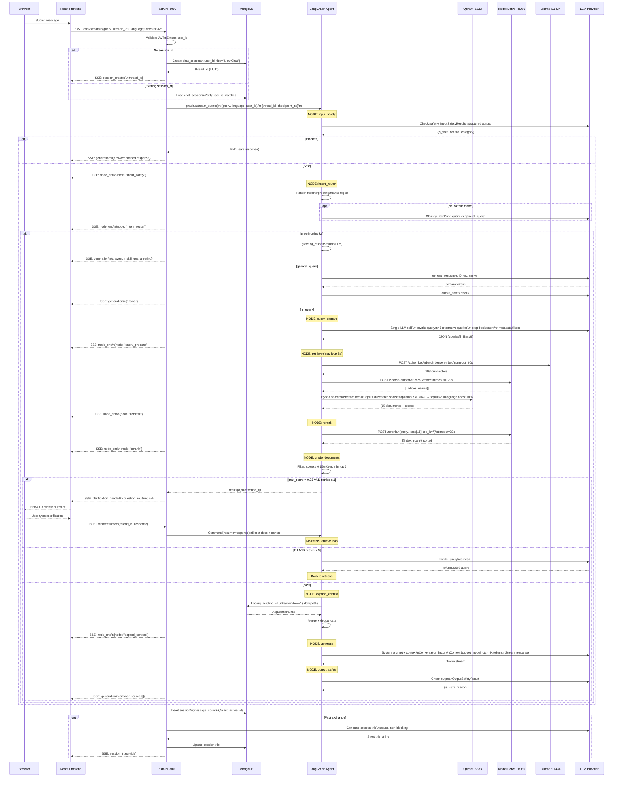

---

## 6. Authentication & JWT Flow

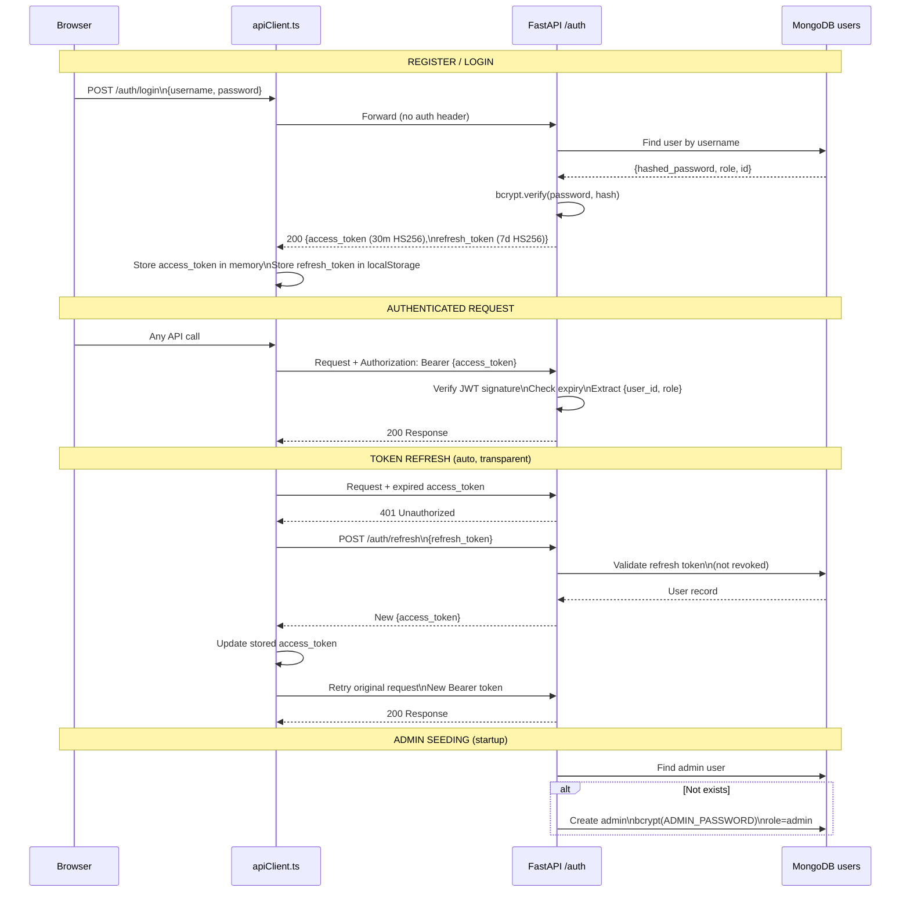

---

## 7. Resource Requirements (Per Service)

```mermaid
graph LR
    subgraph INFRA["INFRASTRUCTURE RESOURCES"]
        direction TB

        FE_R["Frontend (node:20-alpine)\nCPU: 0.25 core\nRAM: 256 MB\nDisk: ~500 MB (node_modules)\nPort: 5173"]

        API_R["FastAPI (python:3.12-slim)\nCPU: 1–2 cores\nRAM: 1–2 GB\n(tesseract OCR = heavy)\nDisk: ~3 GB (libreoffice,\ntesseract uz/ru/en, pandoc,\nOpenCV, PyTorch CPU)\nPort: 8000"]

        LG_R["LangGraph Server (python:3.12-slim)\nCPU: 0.5–1 core\nRAM: 512 MB – 1 GB\nDisk: ~1 GB\nPort: 8123→8000"]

        MS_R["Model Server (python:3.12-slim)\nCPU: 2–4 cores (CPU inference)\nRAM: 2–4 GB\n(jina-reranker model ~500 MB\n+ BM25 model ~100 MB)\nDisk: 1–2 GB (model cache)\nPort: 8080\nStart period: 120s (model download)"]

        MONGO_R["MongoDB 7\nCPU: 0.5 core\nRAM: 512 MB – 2 GB\nDisk: 10–50 GB (sessions,\nLangGraph checkpoints)\nPort: 27017"]

        QDRANT_R["Qdrant\nCPU: 1–2 cores\nRAM: 1–4 GB\n(768-dim vectors)\n~1 GB per 1M vectors\nDisk: 5–20 GB\nPorts: 6333 HTTP, 6334 gRPC"]

        REDIS_R["Redis 7-alpine\nCPU: 0.1 core\nRAM: 64–256 MB\nDisk: minimal\nPort: 6379"]

        MINIO_R["MinIO\nCPU: 0.25 core\nRAM: 256–512 MB\nDisk: 10–100 GB\n(original documents)\nPorts: 9000, 9001"]

        OLLAMA_R["Ollama (host machine)\nCPU: 4–8 cores\nRAM: 8–16 GB\n(nomic-embed 768 ~700 MB\n+ llama3.1 8B ~4.7 GB)\nGPU: optional (speeds ×10)\nPort: 11434"]
    end

    style FE_R fill:#1e3a2f,stroke:#22c55e,color:#f0fdf4
    style API_R fill:#1e2a4a,stroke:#3b82f6,color:#eff6ff
    style LG_R fill:#1e2a4a,stroke:#3b82f6,color:#eff6ff
    style MS_R fill:#2a1e4a,stroke:#a855f7,color:#faf5ff
    style MONGO_R fill:#2a2a1e,stroke:#eab308,color:#fefce8
    style QDRANT_R fill:#2a2a1e,stroke:#eab308,color:#fefce8
    style REDIS_R fill:#2a2a1e,stroke:#eab308,color:#fefce8
    style MINIO_R fill:#2a2a1e,stroke:#eab308,color:#fefce8
    style OLLAMA_R fill:#2a1e4a,stroke:#a855f7,color:#faf5ff
```

---

## 8. Resource Summary Table

| Service | Image | CPU | RAM | Disk | GPU |
|---------|-------|-----|-----|------|-----|
| **Frontend** | node:20-alpine | 0.25 core | 256 MB | 500 MB | — |
| **FastAPI** | python:3.12-slim | 1–2 cores | 1–2 GB | 3 GB | — |
| **LangGraph Server** | python:3.12-slim | 0.5–1 core | 512 MB–1 GB | 1 GB | — |
| **Model Server** | python:3.12-slim | 2–4 cores | 2–4 GB | 1–2 GB | Optional |
| **MongoDB 7** | mongo:7 | 0.5 core | 512 MB–2 GB | 10–50 GB | — |
| **Qdrant** | qdrant/qdrant | 1–2 cores | 1–4 GB | 5–20 GB | — |
| **Redis** | redis:7-alpine | 0.1 core | 64–256 MB | minimal | — |
| **MinIO** | minio/minio | 0.25 core | 256–512 MB | 10–100 GB | — |
| **Ollama (host)** | host binary | 4–8 cores | 8–16 GB | 10–20 GB | Optional |
| **TOTAL (min)** | | **~10 cores** | **~14 GB** | **~42 GB** | — |
| **TOTAL (recommended)** | | **~16 cores** | **~28 GB** | **~100 GB** | 8 GB VRAM |

> **Ollama GPU**: nomic-embed-text ~700 MB VRAM + llama3.1:8B ~5 GB VRAM = ~6 GB minimum. RTX 3060 (12 GB) or better recommended.

---

## 9. Key Configuration Numbers

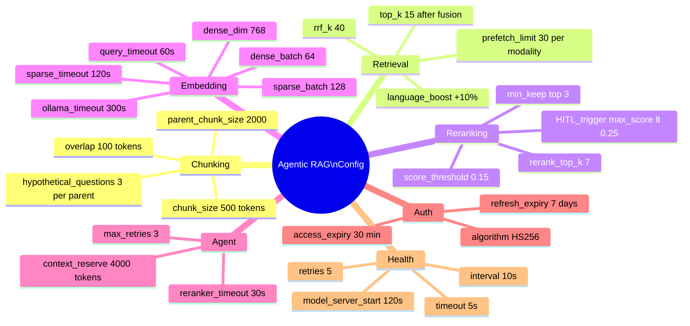

---

## 10. Network & SSL Architecture

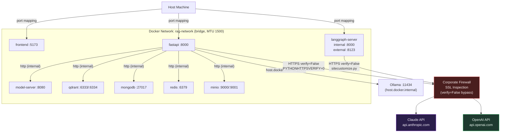

---

## 11. Data Models & MongoDB Collections

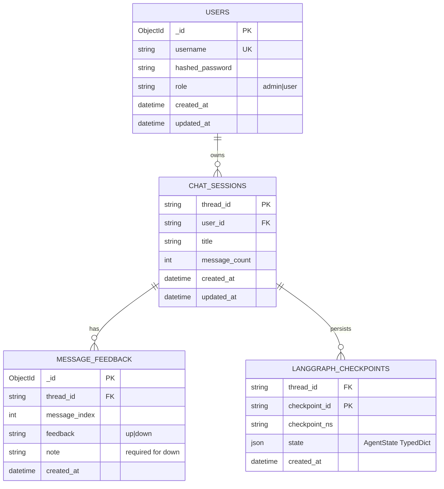

---

## 12. Qdrant Point Schema

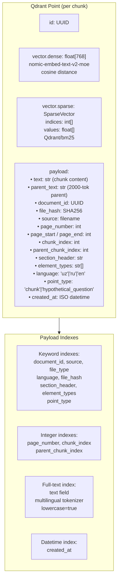

---

*To render these diagrams:*
- **GitHub/GitLab/Notion**: Paste `.md` content directly — Mermaid renders natively
- **VS Code**: Install "Markdown Preview Mermaid Support" extension
- **draw.io version**: Run `/drawio-gen` skill for importable `.drawio` XML
- **PNG export**: `npx @mermaid-js/mermaid-cli -i architecture.md -o architecture.svg`
