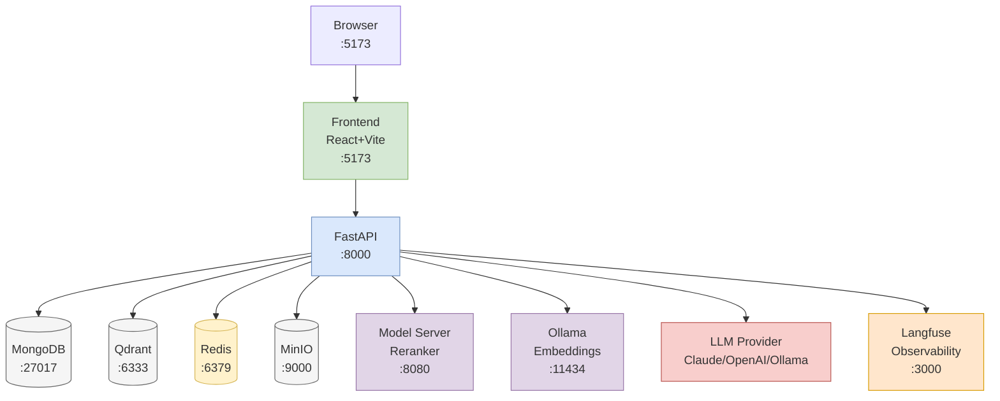
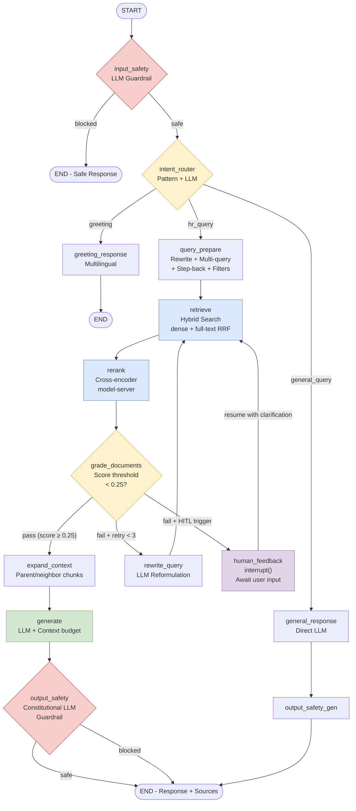
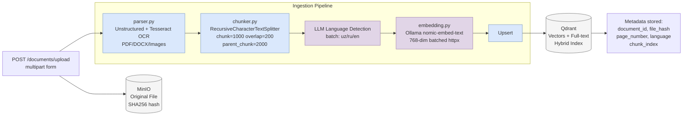
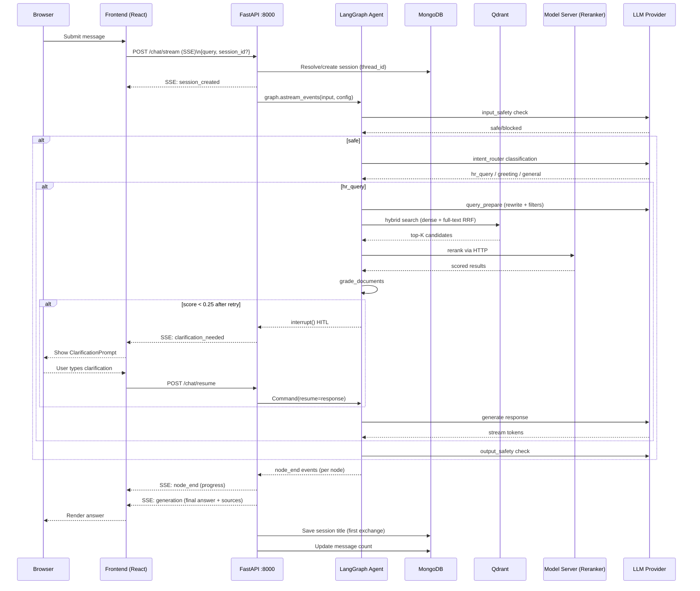
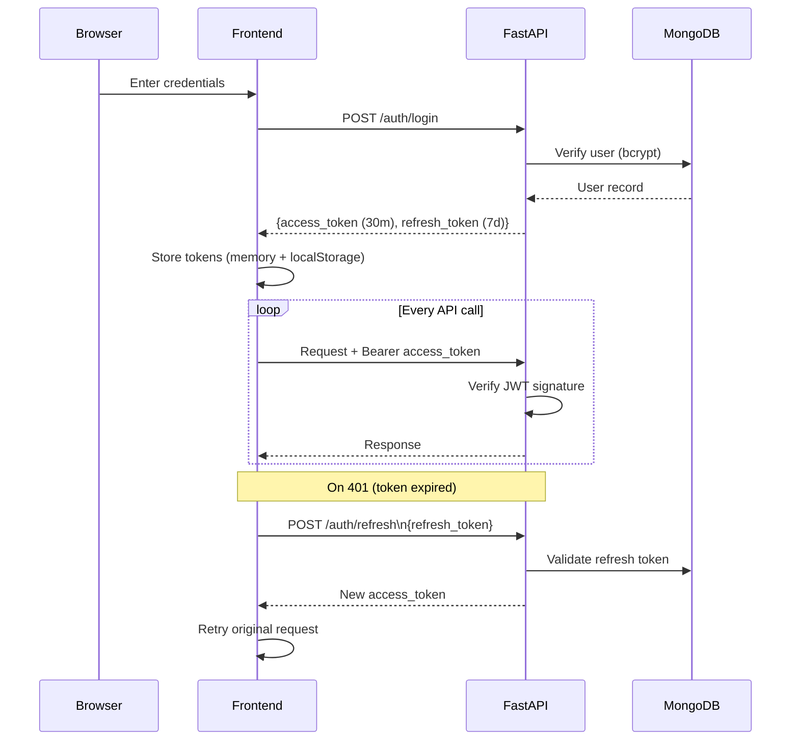
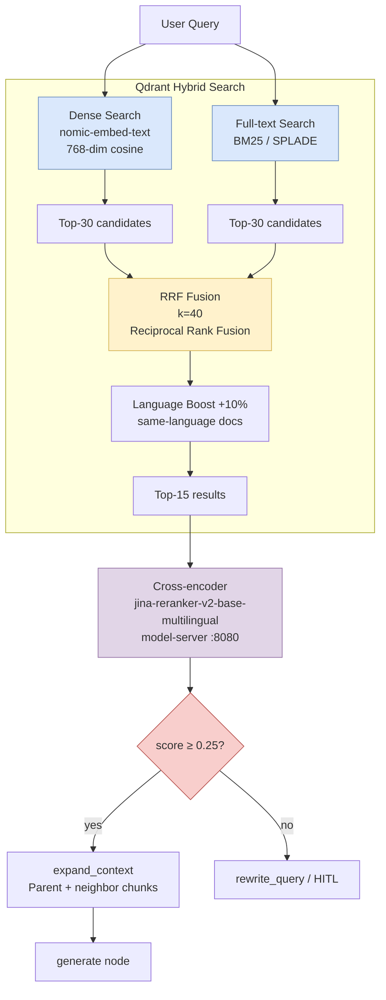

# System Architecture Diagram Generator

Generate architecture and flow diagrams for this RAG application.

## What to generate
$ARGUMENTS

## Steps

1. **Read the project** — scan `CLAUDE.md`, `docker-compose.yml`, `src/agent/graph.py`, `src/api/routes/`, `src/ingestion/`, `src/services/` to understand the current state
2. **Choose format** based on the request:
   - `mermaid` — inline in Markdown, renders in GitHub/Notion/GitLab
   - `drawio` — full `.drawio` XML, import to draw.io / VS Code extension
   - `ascii` — plain text, embeds anywhere
3. **Generate all relevant diagrams** from the list below

---

## Diagrams to Produce

### 1. Service Topology (Docker Compose)
Show all running services, their ports, and inter-service connections.

**Mermaid template:**


---

### 2. LangGraph Agent Flow
Show the full agent state machine with nodes, conditional edges, and routing logic.

**Mermaid template:**


---

### 3. Document Ingestion Pipeline
Show the upload-to-index data flow.

**Mermaid template:**


---

### 4. Chat Request Sequence Diagram
Show the SSE streaming flow from browser to LangGraph and back.

**Mermaid template:**


---

### 5. Authentication Flow

**Mermaid template:**


---

### 6. Hybrid Search Internals

**Mermaid template:**


---

## How to Use Each Format

### Mermaid (recommended for docs)
Paste into any `.md` file. Renders automatically on GitHub, GitLab, Notion, Obsidian.
- Wrap in ` ```mermaid ` ... ` ``` `
- Preview locally: `npx @mermaid-js/mermaid-cli -i diagram.mmd -o diagram.svg`

### draw.io XML
Use `/drawio-gen` skill to get importable `.drawio` XML files.
- Import: `draw.io → File → Import from → Device`
- VS Code: Install "Draw.io Integration" extension, open `.drawio` files directly

### ASCII Art (for terminals/READMEs)
```
[Browser] → [React:5173] → [FastAPI:8000] → [LangGraph Agent]
                                ↓                   ↓
                          [MongoDB:27017]      [Qdrant:6333]
                          [MinIO:9000]         [Redis:6379]
                          [ModelServer:8080]
```

## Output Instructions

1. Read the current codebase to verify the diagram matches actual implementation
2. Generate all 6 diagrams above updated to reflect the real code
3. Note any discrepancies between diagrams and actual code
4. Suggest which diagrams to add to `docs/` or embed in `README.md`
