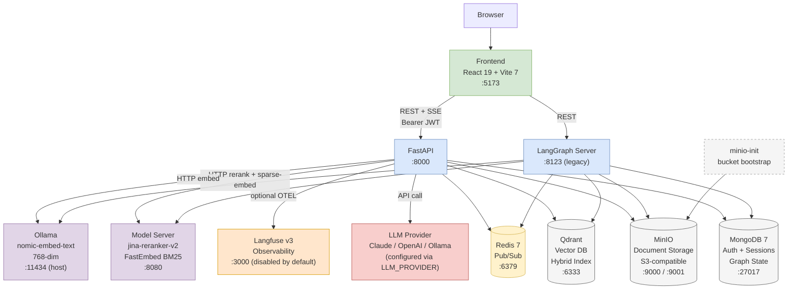
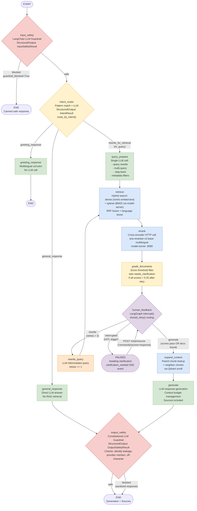
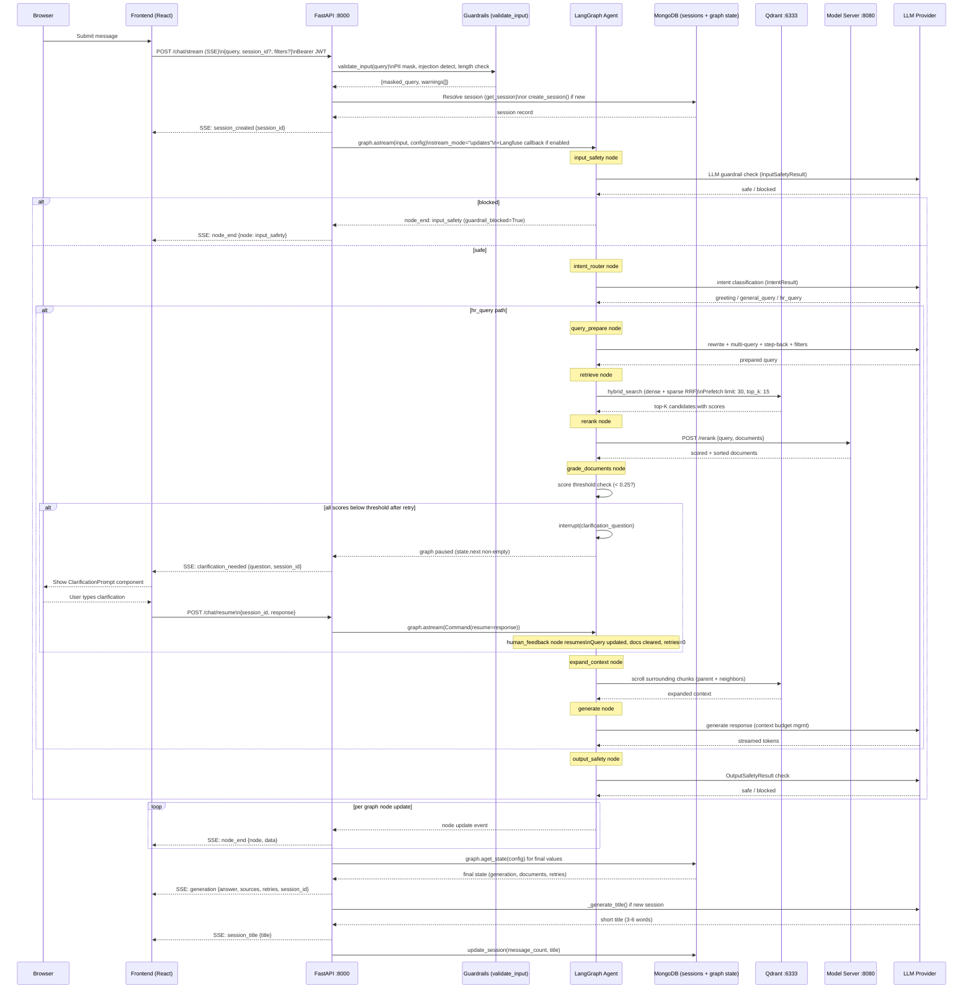
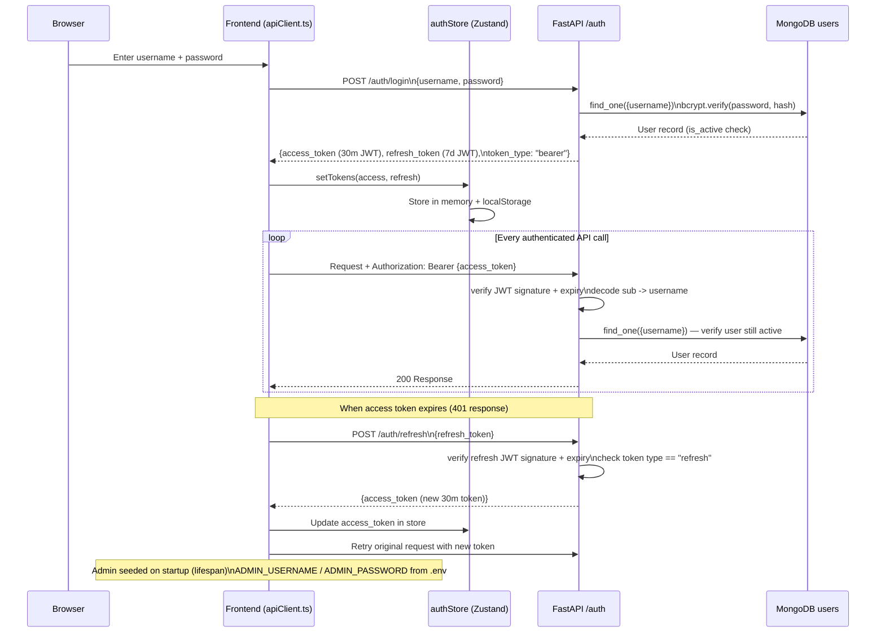
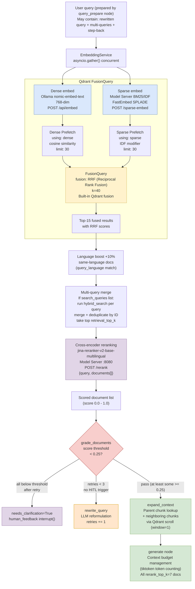

# Agentic RAG — System Architecture Diagrams

Architecture diagrams for the Ipoteka Bank Agentic RAG system. All diagrams reflect the current codebase state as of the last review.

---

## Diagram 1 — Service Topology (Docker Compose)

All running services, their exposed ports, and inter-service communication paths.

**Key notes:**
- Langfuse is fully configured in `docker-compose.yml` but commented out. Re-enable via `LANGFUSE_ENABLED=true` in `.env`.
- Ollama runs on the host machine; Docker containers reach it via `host.docker.internal:11434`.
- LangGraph Server (`:8123`) is a separate container kept for legacy compatibility. The FastAPI backend uses direct graph invocation via `MongoDBSaver` — no langgraph-server dependency for chat.
- Model Server handles both cross-encoder reranking and BM25 sparse embeddings.

---

## Diagram 2 — LangGraph Agent Flow

Full state machine with all nodes, conditional edges, and routing logic. Matches `src/agent/graph.py` exactly.

**Key implementation details:**
- `grade_documents` sets `needs_clarification=True` but always proceeds to `human_feedback` node (no conditional edge before it).
- `human_feedback` uses `should_retry()` for conditional routing: routes to `expand_context` (generate) or `rewrite_query` (retry). When `interrupt()` fires the graph suspends — it does not route.
- `output_safety` receives output from both `general_response` and `generate` paths.
- HITL resume resets `retries=0`, `documents=[]`, appends clarification to query string, then re-enters at `retrieve`.

---

## Diagram 3 — Document Ingestion Pipeline

Upload-to-index data flow. Reflects `src/ingestion/pipeline.py`, `parser.py`, `chunker.py`, and `embedding.py`.

```mermaid
flowchart LR
    Upload["POST /documents/upload\nmultipart form\nPDF / DOCX / Images"] --> DupCheck

    DupCheck{"Duplicate check\nSHA256 hash\nvs Qdrant file_hash index"}
    DupCheck -->|"already exists"| SkipReturn([Return: skipped=True])
    DupCheck -->|"new document"| StoreMinIO

    StoreMinIO["MinIO upload\ndocuments bucket\ndocument_id/filename"] --> Parse

    subgraph Ingestion Pipeline
        Parse["parser.py\nUnstructured library\nTesseract OCR (multilingual)\nPDF/DOCX/HTML/Images\nOutputs: elements with page_number,\nsection_header, element_type"] --> Chunk

        Chunk["chunker.py\nRecursiveCharacterTextSplitter\nchild: size=500 overlap=100\nparent: size=2000\nPreserves: page range, section header,\nelement types per chunk"] --> LangDetect

        LangDetect["Language Detection\nlangdetect library (batch)\nen / ru / uz\ntr -> uz mapping"] --> ContextualHeader

        ContextualHeader["Contextual embedding\nPrepend section_header\nto embedding text only\n(not stored in payload)"] --> EmbedConcurrent

        EmbedConcurrent["Concurrent embedding\nasyncio.gather()"]

        EmbedConcurrent --> DenseEmbed["Dense embedding\nOllama nomic-embed-text\n768-dim cosine\nbatch size: 64\nvia httpx AsyncClient"]
        EmbedConcurrent --> SparseEmbed["Sparse embedding\nModel Server BM25/IDF\nFastEmbed SPLADE\nbatch size: 128\nvia httpx AsyncClient"]
    end

    DenseEmbed --> Upsert
    SparseEmbed --> Upsert

    Upsert["Qdrant upsert\ndense + sparse vectors\nPointStruct with full payload"]

    Upsert --> QdrantIndex[(Qdrant Collection\nVectors: dense 768-dim\nSparse: BM25 IDF modifier\nFull-text: MULTILINGUAL tokenizer\nPayload indexes: document_id,\nsource, language, file_hash,\nchunk_index, page_number,\nsection_header, point_type)]

    Upsert --> HypoQ{"enable_hypothetical\n_questions?"}
    HypoQ -->|yes| GenQuestions["LLM: generate 3 questions\nper unique parent chunk\n(HyDE-style indexing)\nEmbed + upsert as\npoint_type=hypothetical_question"]
    HypoQ -->|no| Done([Return: chunks_count, point_ids])
    GenQuestions --> Done

    style Parse fill:#dae8fc,stroke:#6c8ebf
    style Chunk fill:#dae8fc,stroke:#6c8ebf
    style LangDetect fill:#e1d5e7,stroke:#9673a6
    style ContextualHeader fill:#e1d5e7,stroke:#9673a6
    style DenseEmbed fill:#e1d5e7,stroke:#9673a6
    style SparseEmbed fill:#e1d5e7,stroke:#9673a6
    style Upsert fill:#dae8fc,stroke:#6c8ebf
    style QdrantIndex fill:#f5f5f5,stroke:#666
    style DupCheck fill:#fff2cc,stroke:#d6b656
    style HypoQ fill:#fff2cc,stroke:#d6b656
    style StoreMinIO fill:#f5f5f5,stroke:#666
```

**Key notes:**
- Dense and sparse embeddings run concurrently via `asyncio.gather()` — significant speedup on large documents.
- Language detection uses `langdetect` library (not LLM) — corrects `tr` -> `uz` for Uzbek Latin script confusion.
- Hypothetical questions (HyDE) are optional, controlled by `enable_hypothetical_questions` setting.
- Chunk size defaults: `CHUNK_SIZE=500`, `CHUNK_OVERLAP=100`, `PARENT_CHUNK_SIZE=2000`.

---

## Diagram 4 — Chat Request Sequence (SSE + HITL)

Full SSE streaming flow from browser through FastAPI to LangGraph and back. Reflects `src/api/routes/chat.py`.

---

## Diagram 5 — Authentication Flow (JWT)

JWT-based auth with access + refresh token rotation. Reflects `src/api/routes/auth.py` and `frontend/src/config/apiClient.ts`.

**Token details:**
- `ACCESS_TOKEN_EXPIRE_MINUTES=30` (default)
- `REFRESH_TOKEN_EXPIRE_DAYS=7` (default)
- `JWT_SECRET_KEY` — must be changed in production (default is insecure placeholder)
- `apiClient.ts` handles 401 transparently: refreshes token and retries original request once

---

## Diagram 6 — Hybrid Search Internals (Qdrant RRF)

How Qdrant combines dense and sparse vectors. Reflects `src/services/qdrant_client.py` `hybrid_search()` and `src/agent/nodes.py` retrieve node.

**Configuration values (from `.env` / `settings.py`):**
- `RETRIEVAL_TOP_K=15` — results after RRF fusion
- `RETRIEVAL_PREFETCH_LIMIT=30` — candidates per dense/sparse branch
- `RERANK_TOP_K=7` — docs passed to generate node
- `RRF_K=40` — RRF denominator constant
- `EMBEDDING_DIM=768` — nomic-embed-text vector size

---

## Discrepancies Found vs Skill Template Diagrams

The following differences exist between the codebase and the skill template diagrams:

1. **`grade_documents` does NOT have a direct conditional edge to `expand_context` or `rewrite_query`.**
   The graph always proceeds `grade_documents` -> `human_feedback` -> `should_retry()` routing. The `should_retry()` function handles both the normal pass case and the retry case.

2. **Language detection uses `langdetect` library, not LLM.**
   The ingestion pipeline uses `langdetect` (batch, deterministic) — not an LLM call. The CLAUDE.md description is slightly inaccurate on this point.

3. **`general_response` goes through `output_safety` before END.**
   The template diagram shows `output_safety` only on the HR query path. Both `general_response` and `generate` route through `output_safety`.

4. **Sparse embeddings come from model-server (FastEmbed BM25), not full-text-only.**
   The hybrid search uses: dense via Ollama + sparse via model-server. Qdrant also has a full-text TEXT index on the `text` field, but the primary hybrid search uses the `sparse` vector field with BM25 IDF.

5. **Langfuse is disabled in docker-compose by default.**
   The service topology should show Langfuse as optional/commented-out, not as an active service.

6. **LangGraph Server (`:8123`) is a separate container but FastAPI uses direct graph invocation.**
   The backend does NOT call `langgraph-server` for chat — it invokes the graph directly via `MongoDBSaver` checkpointer. LangGraph Server is kept for legacy/alternative access.

7. **Hypothetical question generation (HyDE-style) exists in the ingestion pipeline.**
   The template diagram does not show this optional indexing step.

---

## Recommended Diagram Placement

| Diagram | Recommended Location |
|---------|---------------------|
| Service Topology | `README.md` top-level overview section |
| LangGraph Agent Flow | `docs/architecture.md` + link in README |
| Document Ingestion Pipeline | `docs/architecture.md` + `/documents/upload` API docstring |
| Chat Sequence (SSE + HITL) | `docs/architecture.md` + frontend `useStreamingChat.ts` header |
| Authentication Flow | `docs/architecture.md` + `src/api/routes/auth.py` header |
| Hybrid Search Internals | `docs/architecture.md` + `src/services/qdrant_client.py` header |
